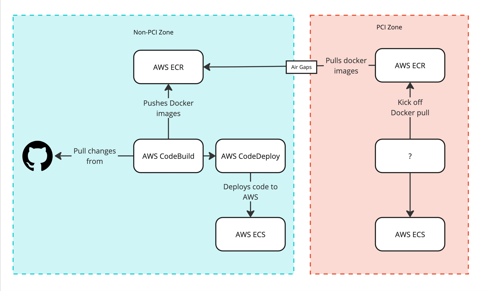

# IAC & PCI Testbed

A little repo to test out some bits using Infrastructure as Code (IaC) in a PCI environment. The idea is that there are two zones, one PCI & one non-PCI. The idea is that items can be separated, the PCI zone protected & for it to pull in what it needs.

In the non-PCI zone, the flow is:

* Code changes are committed to a Git repo.
* CodeBuild detects the changes, clones the repo & builds the service. This results in a Docker image.
* That Docker image is pushed to ECR where it is stored.
* CodeDeploy then takes that image & deploys it to ECS.

Then, in the PCI zone the flow could be:

* CodeDeploy(?) kicks off a deployment. Whatever it is needs to have an audit chain.
* The ECR repository in the PCI zone pulls in the correct Docker image from the non-PCI zone (via appropriate air gaps)
* CodeDeploy(?) then deploys the application to ECS

